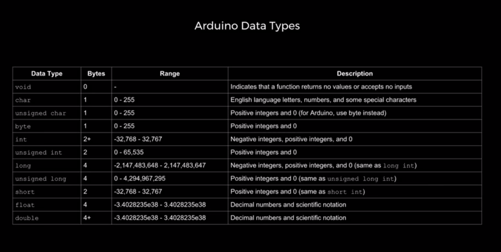

Reflection (1st day) -
-----------------
#### What did we do today:
1. We wrote a program in the Arduino for the first time.
1. We made make a circuit.

#### What did you learn:
1. How a few functions work (PinMode, digitalWriter and delay)
1. Where and how to connect the cables and other components of the circuit in the breadboard.

#### Homework:
1. What is the meaning of void?
ans: it's a variable used only in function declarations that indicates that the function is expected to return no information to the 
function from which it was called. (source: https://www.arduino.cc/reference/tr/language/variables/data-types/void).
1. What are the types of variables?
 
[The figure above shows the types of variable in arduino programming language][source:https://www.youtube.com/watch?v=xmZXWMEltEc&t=271s]

Reflection (2nd day)
--------------------
### What did we do today :
1. Quiz
1. Correction of the quiz
1. Program to turn on 2 leds by using binary (introduction to binary)

#### WHat did I learn:
1. Improved my understanding on types of variables
1. How to count binary
1. How to turn on leds by using if statement

##### Homework:
1. Weekend task: exercises about binary and conversion from binary to decimal and vice-versa.

Reflection (3rd day)
-----------------------------
#### What did we do today:
1. warm up- converting types of data representations
1. Correction of homework - ways to write code and evaluation
1. Binary logic (and, or, xor, not, nand, nor)

#### What did you learn:
1. The symbols of binary logic
1.How to count in different bases
1. How to use binary logic to find the pattern in a table

#### Homework:
1. Solve the hw tables again but using binary logic

#### Links found on internet
http://www0.cs.ucl.ac.uk/teaching/B261/truth_tables.html


Reflection (4th day)
-----------------------------
#### What did we do today:
1. Solve a sheet about binary logic


#### What did you learn:
1. Got a better understanding on how to do and interpret logic tables

#### Questions:
1. I tried doing the tables hw again using boolean but its not working 
1. I still need to pratice counting in different bases


Reflection (5th day)
-----------------------------
#### What did we do today:
1. Solving ib exams type of questions
1. warm up activity: do a program that lights up lcds in order to form numbers from 0 to 7 by using a logic table and logic equations.

#### What did you learn:
1. it was a good practise to improve my undertanding on logic tables

#### Homework:
1. Finish the program 


Reflection (6th day)
-----------------------------
#### What did we do today:
1. Solving IB type of question
1. Programing

#### What did you learn:
1. How are questions in IB about logic gates

Reflection (7th day) - 25th November
-----------------------------
#### What did we do today:
1. What is usability?

```
In software engineering, usability is the degree to which a software can be used by specified consumers to achieve quantified objectives with effectiveness, efficiency, and satisfaction in a quantified context of use. 
```
```
[“Usability.” Usability - Computer Science Wiki, computersciencewiki.org/index.php/Usability.]
```
1. Human-centered design HCD

```
POSNER I, MARS R. "Its not you, bad doors are everywhere" 2016. Retrieved https://www.youtube.com/watch?v=yY96hTb8WgI (25 Nov 2019) 
 ```
1. Work on elgish input system

 #### What did you learn:
 
 Reflection (8th day) -  2nd December
 -------------------
 #### What did we do today:
 1. Computer architecture 
 1. Build arduino input system

 
 #### What did you learn:
 1. Arduino is 8 bit
 1. Our computers can store memories that are 64 bits long, when the memory to be stored is more than 64, the computer divides it into different sets and keeps track of it 
 1. RAM and flask (search)
 1. The computer is a linear machine
 
 Reflection (9th day) - 6th January
 ----------------
 #### What did we do today:
 1. warm up practise on C programming language
 1. data formats of C language
 1. Protocols
 
 #### What did you learn:
 1.Types of protocols
 1. C programming language (similarites and differences with arduino)
 
 #### homework
 1. copy the protocols table to your repository
 
 
  
  
  
 
 LINKS
 ---------
 
 ### Hexadecimal:
 https://www.electronics-tutorials.ws/binary/bin_3.html
 https://www.bbc.co.uk/bitesize/guides/zp73wmn/revision/1
 
 ### SAS
 https://www.nibusinessinfo.co.uk/content/advantages-and-disadvantages-software-service-saas
 https://www.outsource2india.com/software/articles/software-as-a-service.asp
 https://www.racemi.com/saas-advantages-and-disadvantages/
 
 
 ## past papers
  https://drive.google.com/drive/folders/1MBiCoji39U1OYV2_ZhNWFF1iDUzjzUtZ
