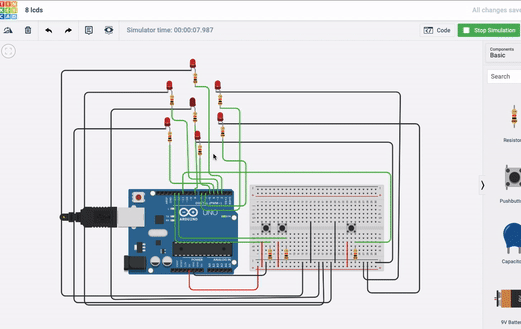

# Unit_2_Project_Lauricenia
This repository will be used to record the steps for creating the mars communication system program


 
<details><summary>Planning</summary>

  Definition of the problem
  ==========================
  My client,the National Aeronautics and Space Administration (NASA) is a U.S. government agency responsible for science and technology related to air and space[1]. The agency launched a competition among the most famous programmers to create a communication system between Earth and Mars, and the Moon and Mars. The requirements outlined by the agency was a system that allows the users in the stations of Mars to communicate seamlessly using English with the two other stations. The keyboard input on each station must be limited to 2 push buttons and only 100W lights buzzers must be available. The current technology limitates the Mars station to communicate only in binary. 
  
  Proposed solution
  ===================
 Since the Mars station can only communicate using binary and the users must be able to send and recieve messages in english, its necessary to make a system that is able to execute the conversion between these two languages. The system should allow the user to enter the message in english then convert it to binary and send it to other station, in the same way, it should be able to receive the message in binary language and present it to the user in english. The user will be able to input the message using two buttons: left button - by which will browse through the options available (alphabet, digits,space,sent, delete) and the right button- by which can choose the option.

  Success criteria 
  ====================
  These are the measurable outcomes :
  1. Users can communicate effectively in english using 2 buttons; 
  1. System can send messages;
  1. System can receive messages; 
  1. System can convert messages from english to binary;
  1. System can convert messages from binary to english.
 
<p></details>
 

<details><summary>Design</summary>
  
  System diagram
  ==============
  first draft
  -------------
 
 
  Algorithms flow diagram
  ====================
  #### Flow chart for the English Input System
  
   First drafts
   -------------
 
 
  Testplan
  ============
<p></details>
 
 
<details><summary>Development</summary>
 
 ## Single led blink program
 
 ```.sh
 void setup()
{
  //pinMode(pin, mode)
  
 /*
 *This function configures the 13 pin to behave as output
 *It changes the electrical behaviour of the pin
 *OUTPUT means the pin can provide a substantial amount of current to other circuits
 */ 
 pinMode(13, OUTPUT);
}

void loop()
{
  //digitalWrite(pin, value)
  //delay(milliseconds)
  
  /*
  *This function sets writes the HIGH value to the 13 pin
  *HIGH means that its voltage will be set to 5V (the light will light on)
  */
 digitalWrite(13, HIGH);
   ```
 
 ## 8 lcds
 -This program forms numbers from 0 to 1 with the leds using boolean logic.
 
 
 
 ```.sh
 bool  a = ( !A & !C ) | B | ( A & C );
bool  b = ( !B & !C ) | ( A & !C )  | ( A & !B & C );
bool  c = ( !A & !C ) | ( B & !C );
bool  d = ( !A & !C ) | ( !A & B ) | ( B & !C ) | ( A & !B & C );
bool  e = ( !B & !C ) | ( A & B ) | C ;
bool  f = (!B & !C) | ( !A & B ) | ( B & C ) | ( !A & !B & C );
bool  g = ( A & !C ) | ( B & !C ) | ( !A & B ) | ( A & !B & C ) ;
 
  
digitalWrite(out1, a );
digitalWrite(out2, b );
digitalWrite(out3, c );
digitalWrite(out4, d );
digitalWrite(out5, e );
digitalWrite(out6, f );
digitalWrite(out7, g );
                     
 ```
 ## Convert binary to decimal
 -This program converts a decimal input by the user into binary representation
 ```.sh
 String numb = "";
int remainder;
int sum=0;
int i = 0;

void setup()
{
 Serial.begin(9600);
  Serial.println("You have 5 seconds to put the binary number");
  delay(5000);
  while (Serial.available() > 0) {
    char inChar = Serial.read();
    numb += inChar;
  }
  delay(1000);
  int result = numb.toInt();
  while (result > 0) {
remainder = result % 10;
    
   // https://forum.arduino.cc/index.php?topic=2392.0
  sum = sum + remainder * ( 0.5 + pow(2,i) );
  result = result / 10;
    i++;
  }
   Serial.println(sum);
}

void loop()
{ 
}               ```
 
 
 ## What is usability?

```
In software engineering, usability is the degree to which a software can be used by specified consumers to achieve quantified objectives with effectiveness, efficiency, and satisfaction in a quantified context of use.[2]
```

## English Input System

```.sh
String text = "";
int index = 0; 
String keyboard[]={"A", "B", "C", "D", "E", "F", "G", "H", "I", "J", "K", "L", "M", "N", "O", "P", "Q", "R", "S", "T", "U", "V", "W", "X", "Y", "Z", "1", "2", "3", "4", "5", "6", "7", "8", "9", "0"," ", "SENT", "DEL"};
int numOptions = 38;

                   
void setup()
{
  Serial.begin(9600);
  attachInterrupt(0, changeLetter, RISING);//button A in port 2
  attachInterrupt(1, selected, RISING);//button B in port 3
}


void loop()
{
  Serial.println("Option (Select:butB, Change:butA): " + keyboard[index]);
  Serial.println("Message: "+ text);
  delay(100);
}

//This function changes the letter in the keyboard
void changeLetter(){
  index++;
if (index > numOptions){
  	index=0; //loop back to first row
  } 
}

//this function adds the letter to the text or send the msg
void selected(){
String key = keyboard[index];

if ( key == "DEL" )
{
int len = text.length();
text.remove(len - 1);
}
  else if ( key  == "SEND" ) 
{
Serial.print("Message sent");
text = "";
}
  else 
  { 
    text+=key;
  }

index = 0;
```

<p></details>
   
   
<details><summary>Evaluation</summary>
  
  Evidence of success criteria
  =========================
  
  
  Recommendations for the future 
  ====================


 <p></details>
   
  
 <details><summary>References</summary>
 [1]https://www.nasa.gov/audience/forstudents/5-8/features/nasa-knows/what-is-nasa-58.html  
 [2]“Usability.” Usability - Computer Science Wiki, computersciencewiki.org/index.php/Usability.
 <p></details> 
