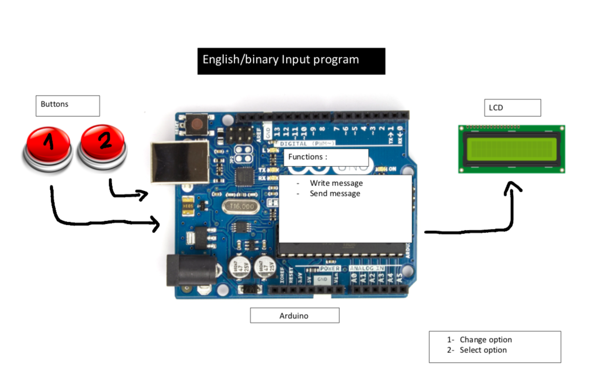

# Unit_2_Project_Lauricenia
This repository will be used to record the steps for creating the mars communication system program


 
<details><summary>Planning</summary>

  Definition of the problem
  ==========================
  My client,the National Aeronautics and Space Administration (NASA) is a U.S. government agency responsible for science and technology related to air and space[1]. The agency launched a competition among the most famous programmers to create a communication system between the Moon and Mars. The requirements outlined by the agency was a system that allows the users in the stations to communicate seamlessly using English. The current technology limitates the keyboard input on each station to 2 push buttons with only 2 100W lights buzzers available and the capacity to communicate only in binary. 
  
  Proposed solution
  ===================
Taking into account that the users must be able to send and receive messages in english and the technology limitations of the stations, the system must be able to execute the conversion between these two languages, input the english language using 2 push buttons and output the binary language by using the light buzzers. This project is meant to be projected into mars and moon. Taking into consideration that it will be the first contact for the users with a system like this one and it is an experimental project in two planets in which communication with earth for assistance may be difficult , one of the important goals for these project was making sure that the system was simpliflied and organized in such a way that would easy for the user to learn how to use it to. For that we had to make sure the program was designed accordingly with the needs of the stations and the users(usability). The system will have three components one that allows the user to input the message in english, one that converts the english message into binary and sends the message and other that converts the binary message into english. The user will be able to input the message using two buttons: left(blue) button - by which will browse through the options available (alphabet, digits,space,sent, delete) and the right(red) button- by which can choose the option. When the user chooses the option "send" the message will be converted to binary and then sent to the other station. When in the other station, the message will be output by a system of 2 light buzzers: one that keeps track of the time and counting by blinking every second and the other that keeps track of the binary message sent by turning off when its 0 and on when 1. Everytime the time lamp turns on, represents one digit of the binary. The user will have to read the binary message using both lamps and input it to the program that will convert it to english. The system will be developed by using arduino, an open-source electronics platform based on easy-to-use hardware and software. I chose arduino because it is relatively less expensive than the rest of the microcontrollers platforms, it has an easy language and it's ready structure makes the wiring and testing process much easier and faster. Arduino also has a large internet comunity and a website that provide many examples and explanations of the arduino features. It also has online versions that enable me to test smaller parts of the program by using a virtual arduino hardware. Git Hub will be used to record all the steps in the process of creating the Mars-Moon communication system. It helps in the organization and keeping track of the progress of the project.
(how do you wish for the system to work exactly)

  Success criteria 
  ====================
  These are the measurable outcomes :
  1. Users can input message in english using 2 buttons; 
  1. System can send messages;
  1. System can receive messages; 
  1. System can convert messages from english to binary;
  1.System can input message in binary using 2 buttons;
  1. System can convert messages from binary to english.
  1.Usability.
  
 
<p></details>
 

<details><summary>Design</summary>
  
  System diagram
  ==============
  
  English Input 
  ----------------------
   
   
   Convert English to Binary
   --------------------------
   
   
   Convert Binary to English
   ---------------------
   
   
   
   
  first draft
  -------------
 
 
  Algorithms flow diagram
  ====================
  #### Flow chart for the English Input System
  
   First drafts
   -------------
 
 
  Testplan
  ============
<p></details>
 
 
<details><summary>Development</summary>
 
 ## Single led blink program
 
 ```.sh
 void setup()
{
  //pinMode(pin, mode)
  
 /*
 *This function configures the 13 pin to behave as output
 *It changes the electrical behaviour of the pin
 *OUTPUT means the pin can provide a substantial amount of current to other circuits
 */ 
 pinMode(13, OUTPUT);
}

void loop()
{
  //digitalWrite(pin, value)
  //delay(milliseconds)
  
  /*
  *This function sets writes the HIGH value to the 13 pin
  *HIGH means that its voltage will be set to 5V (the light will light on)
  */
 digitalWrite(13, HIGH);
   ```
 
 ## 8 lcds
 -This program forms numbers from 0 to 1 with the leds using boolean logic.
 
 
 
 ```.sh
 bool  a = ( !A & !C ) | B | ( A & C );
bool  b = ( !B & !C ) | ( A & !C )  | ( A & !B & C );
bool  c = ( !A & !C ) | ( B & !C );
bool  d = ( !A & !C ) | ( !A & B ) | ( B & !C ) | ( A & !B & C );
bool  e = ( !B & !C ) | ( A & B ) | C ;
bool  f = (!B & !C) | ( !A & B ) | ( B & C ) | ( !A & !B & C );
bool  g = ( A & !C ) | ( B & !C ) | ( !A & B ) | ( A & !B & C ) ;
 
  
digitalWrite(out1, a );
digitalWrite(out2, b );
digitalWrite(out3, c );
digitalWrite(out4, d );
digitalWrite(out5, e );
digitalWrite(out6, f );
digitalWrite(out7, g );
                     
 ```
 ## Convert binary to decimal
 -This program converts a decimal input by the user into binary representation
 ```.sh
 String numb = "";
int remainder;
int sum=0;
int i = 0;

void setup()
{
 Serial.begin(9600);
  Serial.println("You have 5 seconds to put the binary number");
  delay(5000);
  while (Serial.available() > 0) {
    char inChar = Serial.read();
    numb += inChar;
  }
  delay(1000);
  int result = numb.toInt();
  while (result > 0) {
remainder = result % 10;
    
   // https://forum.arduino.cc/index.php?topic=2392.0
  sum = sum + remainder * ( 0.5 + pow(2,i) );
  result = result / 10;
    i++;
  }
   Serial.println(sum);
}

void loop()
{ 
}               
```
 
 
 ## What is usability?

```
In software engineering, usability is the degree to which a software can be used by specified consumers to achieve quantified objectives with effectiveness, efficiency, and satisfaction in a quantified context of use.[2]
```
This project is meant to be projected into mars and moon. Taking into consideration that it will be the first contact for the users with a system like this one and it is an experimental project in two planets in which communication with earth for assistance may be difficult , one of the important goals for these project was making sure that the system was simpliflied and organized in such a way that would easy for the user to learn how to use it to. For that we had to make sure the program was designed accordingly with the needs of the stations and the users. 

## English Input System

```.sh
String text = "";
int index = 0; 
String keyboard[]={"A", "B", "C", "D", "E", "F", "G", "H", "I", "J", "K", "L", "M", "N", "O", "P", "Q", "R", "S", "T", "U", "V", "W", "X", "Y", "Z", "1", "2", "3", "4", "5", "6", "7", "8", "9", "0"," ", "SENT", "DEL"};
int numOptions = 38;

                   
void setup()
{
  Serial.begin(9600);
  attachInterrupt(0, changeLetter, RISING);//button A in port 2
  attachInterrupt(1, selected, RISING);//button B in port 3
}


void loop()
{
  Serial.println("Option (Select:butB, Change:butA): " + keyboard[index]);
  Serial.println("Message: "+ text);
  delay(100);
}

//This function changes the letter in the keyboard
void changeLetter(){
  index++;
if (index > numOptions){
  	index=0; //loop back to first row
  } 
}

//this function adds the letter to the text or send the msg
void selected(){
String key = keyboard[index];

if ( key == "DEL" )
{
int len = text.length();
text.remove(len - 1);
}
  else if ( key  == "SEND" ) 
{
Serial.print("Message sent");
text = "";
}
  else 
  { 
    text+=key;
  }

index = 0;
}
```


PROTOCOL
==============
|Protocol's name | created by | Used in |
|----------------|------------|----------|
| IP | Vint Cerf & Robert E.Kahn| host or network interface identification and location addressing|
| FTP| Abhay Bhusan| transfering files between client and server|
| SSH| Tatu Ylönen| log into a remote machine and execute commands|
|SMTP| RFC 82l| sending/receiving email|
|Telnet| UCLA| allows you to connect to remote computers(hosts)|
|POP3| Mark Crisein|email protocol -> receive/send emails, allows you to download emails|
|HTTP| Tim Berners-Lee | worlwide web: transfer data over the web|
|VPN| Gurdeep Singhpal| a secure tunnel between two or more devices used to protect private web traffic from snooping, interference, and censorship.| 

How will the information on this project be transmitted 
---------------------------------------
1- when my computer is sending the message, one specific light buzzer of all the computers must start blinking
2- when it is sent, the light must stay on till the message is open and off for the computers that will not recieve the message.


<p></details>


<details><summary>Evaluation</summary>
  
  Evidence of success criteria
  =========================
  
  
  Recommendations for the future 
  ====================


-----------------------------------


 <p></details>
   
  
 <details><summary>References</summary>
 [1]https://www.nasa.gov/audience/forstudents/5-8/features/nasa-knows/what-is-nasa-58.html  
 [2]“Usability.” Usability - Computer Science Wiki, computersciencewiki.org/index.php/Usability.
 <p></details> 
https://www.codeclouds.com/blog/advantages-disadvantages-using-github/
