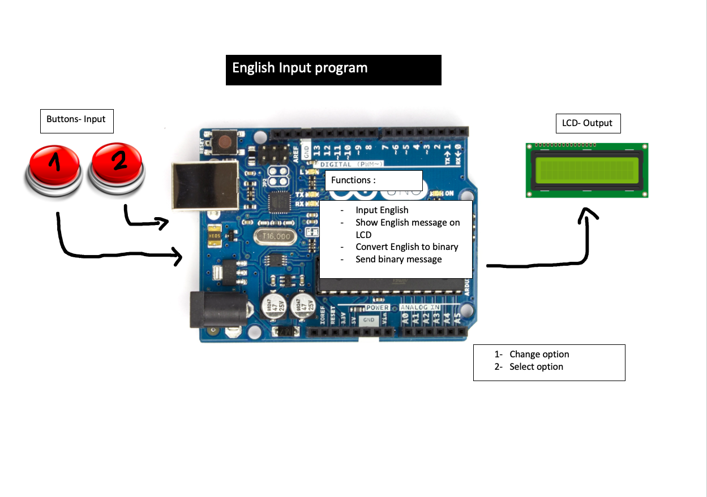
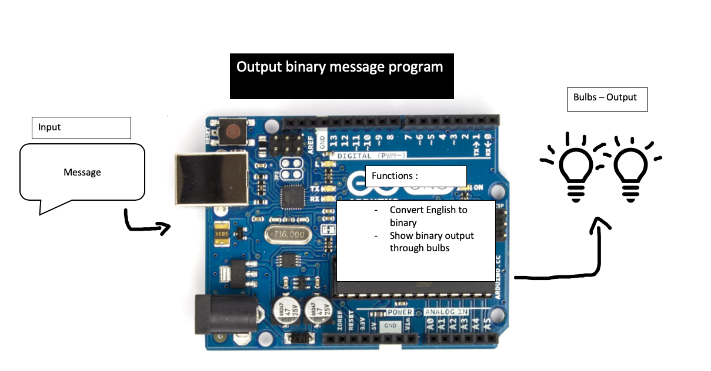
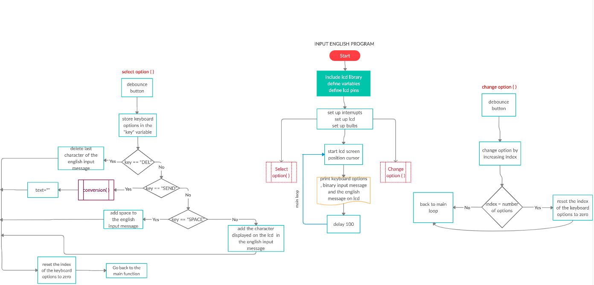
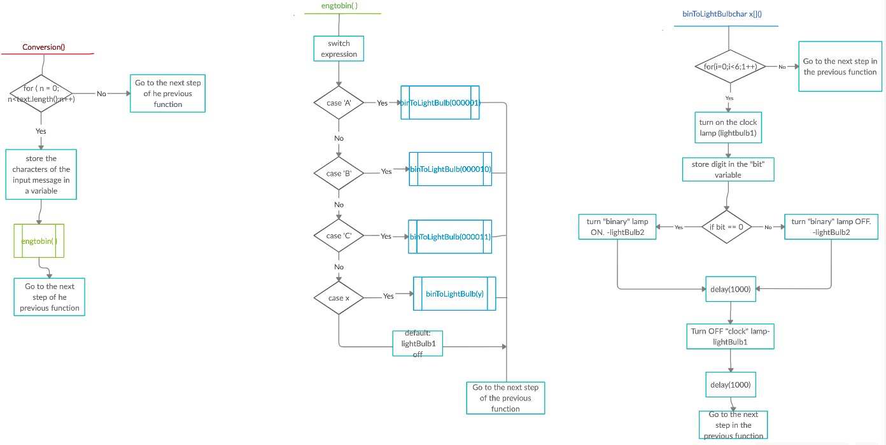
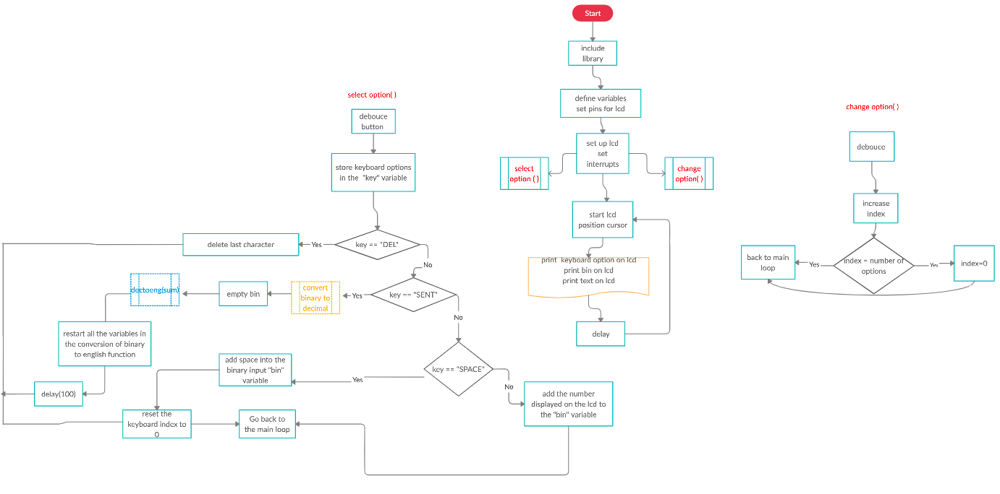
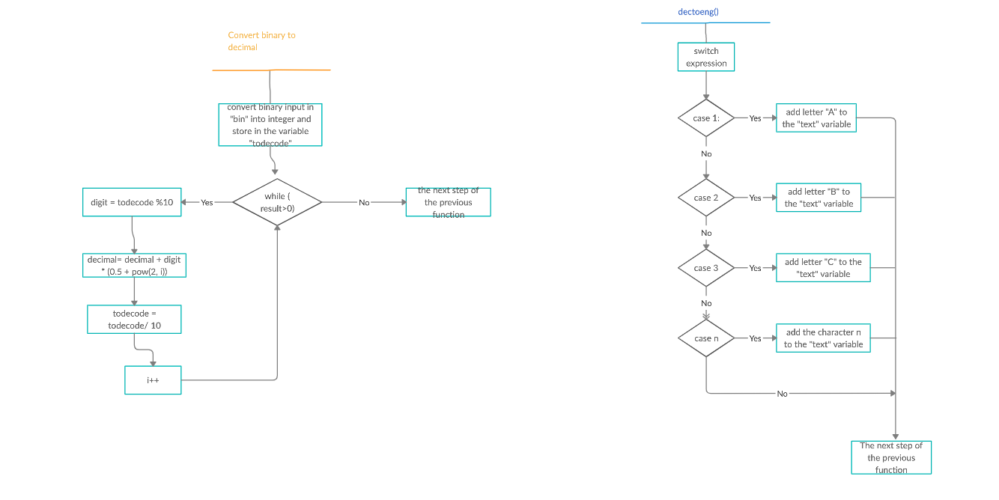
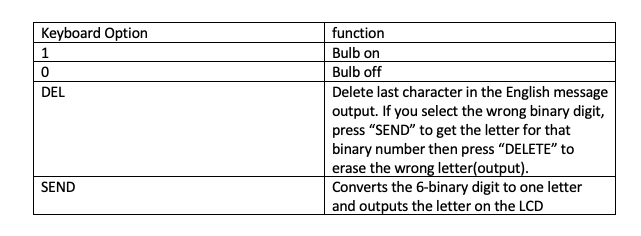

# Unit_2_Project_Lauricenia
This repository will be used to record the steps for creating the mars communication system program


 
<details><summary>Planning</summary>

  Definition of the problem
  ==========================
  My client,the National Aeronautics and Space Administration (NASA) is a U.S. government agency responsible for science and technology related to air and space[1]. The agency launched a competition among the most famous programmers to create a communication system between the Moon and Mars. The current technology limitates the keyboard hardware on each station to 2 push buttons, only 2 100W lights buzzers are available and the exchange of messages between the stations is only possible using the binary language. The requirement outlined by the agency was a system that allows the users in the stations to communicate seamlessly using English making use of the precarious technology available.
  
  Proposed solution
  ===================
 Taking into account that the users must be able to write and receive messages in english despite the fact that the technology can only send/receive messages using binary, the new system must include a program that executes the conversion between these two languages. The sender will input the english message, the message will be converted and output using the light buzzers. The receiver must read the binary (1-On/ 0-off) and input the binary into a program that will convert it back to english. Thus, the system will have two big parts one that allows the user to input the message in english and converts the english message into binary(bulbs) and other that converts the binary message into english. 
 The system will be developed by using arduino. I chose arduino because it is relatively less expensive than the rest of the microcontrollers platforms, it has an easy language and it's ready structure makes the wiring and testing process much easier and faster. Arduino also has a large internet comunity and a website that provides many examples and explanations of it's features. It also has online simulators, I used tinkercad, that allows me to test smaller parts of the program, or work on the system when I dont have a physical arduino available. I am also using Git Hub to record all the steps of the creation of the Mars-Moon communication system. Git hub helps in the organization and keeping track of the progress of the project.
 Since this project is meant to be used in mars and moon, communication with earth for assistance may be difficult. Thus, one of the important goals for these project is making sure that the system is simpliflied and organized in such a way that will be easy for the users to understand and learn how to use it to (usability).

  Success criteria 
  ====================
  These are the measurable outcomes :
  1. The system can input message(in english/binary);
  1. The binary message can be shown using bulbs;
  1. The english message converted from binary can be shown on the LCD;
  1. System can convert messages from  english to binary;
  1. System can convert messages from binary to english;
  1. Usability.
  
 
<p></details>
 

<details><summary>Design</summary>
  
  System diagram
  ==============
  
  English Input and Conversion to Binary
  ----------------------
  This image illustrates the english input and conversion function of the system. The buttons serve as the input : button 1 - by which will browse through the options available (alphabet,numbers: 0-9, space, send, delete) and the button 2- by which the user can choose the option. When the user chooses the option "SEND" the message will be converted to binary and the binary message will be directed to the system in FIG.
   
   *Fig. 1: English input and conversion*
   
  Binary Output
   --------------------------
The binary message will be output by a system of 2 light buzzers: one that keeps track of the time and the counting by blinking every second and other that keeps track of the binary message received by turning off when it is 0 and on when it is 1. Everytime the "clock" lamp turns on, represents one digit of the binary. On the final program this part will be directly linked with the system in figure .
   
   *Fig. 2: Binary output*
   
   Binary input and Conversion to English
   ---------------------
   Once the light buzzers are starting to output the binary message, the user should be ready to read the zeros and ones and input them in another part of the system responsible for the conversion from binary to english by using a similar input system as of the english input, however with less options since to write binary, its only necessary 1 and 0. The English message resultant from the conversion will be output on the LCD.
   
  *Fig. 3 : Binary input and conversion*
 
  Algorithms flow diagram
  ====================
  
  Flow chart for the English Input and conversion to binary program
  ----------------
  
  *Fig. 4 : English input*
  
  
 *Fig. 5 :English to binary and binary output*

  
  Flow chart for the Binary input and conversion to english program
  -----------------
  
  
  *Fig.6 : Binary input and binary to english*
  
  
 *Fig. 7: Binary to english-part2*
 
 
  Testplan
  ============
  
  
<p></details>
 
 
<details><summary>Development</summary>
 
First steps
---------------
 In the process of brainstorming the ideas for the project, many single short programs were tested. At the end most of them were used in some parts of the system and helped in the process of building the system, for example, to test the binary output functionality,the program in Fig.9 was used:
 
 ## Single led blink program
 
 *Fig. 9- single led blink*
 
 ```.sh
 void setup()
{
  //pinMode(pin, mode)
  
 /*
 *This function configures the 13 pin to behave as output
 *It changes the electrical behaviour of the pin
 *OUTPUT means the pin can provide a substantial amount of current to other circuits
 */ 
 pinMode(13, OUTPUT);
}

void loop()
{
  //digitalWrite(pin, value)
  //delay(milliseconds)
  
  /*
  *This function sets writes the HIGH value to the 13 pin
  *HIGH means that its voltage will be set to 5V (the light will light on)
  */
 digitalWrite(13, HIGH);
   ```
 
 ## 8 lcds
 -This program forms numbers from 0 to 1 with the leds using boolean logic. (ended up not being used but helped in the understanding of binary)
 
 
 *Fig. 10- the 8 lcd*
 
 ```.sh
 bool  a = ( !A & !C ) | B | ( A & C );
bool  b = ( !B & !C ) | ( A & !C )  | ( A & !B & C );
bool  c = ( !A & !C ) | ( B & !C );
bool  d = ( !A & !C ) | ( !A & B ) | ( B & !C ) | ( A & !B & C );
bool  e = ( !B & !C ) | ( A & B ) | C ;
bool  f = (!B & !C) | ( !A & B ) | ( B & C ) | ( !A & !B & C );
bool  g = ( A & !C ) | ( B & !C ) | ( !A & B ) | ( A & !B & C ) ;
 
  
digitalWrite(out1, a );
digitalWrite(out2, b );
digitalWrite(out3, c );
digitalWrite(out4, d );
digitalWrite(out5, e );
digitalWrite(out6, f );
digitalWrite(out7, g );
                     
 ```
 ## Convert binary to decimal
 -This program converts a decimal input by the user into binary representation(this program was used in the conversion of binary to english )
 ```.sh
 String numb = "";
int remainder;
int sum=0;
int i = 0;

void setup()
{
 Serial.begin(9600);
  Serial.println("You have 5 seconds to put the binary number");
  delay(5000);
  while (Serial.available() > 0) {
    char inChar = Serial.read();
    numb += inChar;
  }
  delay(1000);
  int result = numb.toInt();
  while (result > 0) {
remainder = result % 10;
    
   // https://forum.arduino.cc/index.php?topic=2392.0
  sum = sum + remainder * ( 0.5 + pow(2,i) );
  result = result / 10;
    i++;
  }
   Serial.println(sum);
}

void loop()
{ 
}               
```


 The algorithms for the Mars-Moon communication system
 -------------------

## English Input System  

```.sh
// include the library code:
#include <LiquidCrystal.h>
// add all the letters and digits to the keyboard
String keyboard[]={"SEND", "DEL", "SPACE", "A", "B", "C", "D", "E", "F", "G", "H", "I", "J", "K", "L", "M", "N", "O", "P", "Q", "R", "S", "T", "U", "V", "W", "X", "Y", "Z", "0", "1", "2", "3", "4", "5", "6", "7", "8", "9", };

int numOptions = 39; //size of keyboard

int index = 0; 

String text = "";//variable to store input


// initialize the library with the numbers of the interface pins
LiquidCrystal lcd(12, 11, 5, 4, 9, 8);

void setup() {
  // set up the LCD's number of columns and rows:
  lcd.begin(16, 2);
  attachInterrupt(0, changeLetter, RISING);//button A in port 2
  attachInterrupt(1, selected, RISING);//button B in port 3
}

void loop() {
  // set the cursor to column 0, line 1
  // (note: line 1 is the second row, since counting begins with 0):
  lcd.clear();
  lcd.setCursor(0, 0);
  //print keyboard option
  lcd.print(keyboard[index]);
  lcd.setCursor(0, 1);
  //print input
  lcd.print(text);
  delay(100);
}

//This function changes the keyboard option
void changeLetter(){
  //debounce function
  static unsigned long last_interrupt_time = 0;
  unsigned long interrupt_time = millis();
  if (interrupt_time - last_interrupt_time > 200)
  {
  
    last_interrupt_time = interrupt_time;// If interrupts come faster than 200ms
    index++;
      //check for the max row number
    if(index==numOptions){
      index=0; //loop back to first row
    } 
  }
}

//this function adds the letter to the text or send the msg
void selected(){
//debounce function
  static unsigned long last_interrupt_time = 0;
  unsigned long interrupt_time = millis();
  if (interrupt_time - last_interrupt_time > 200)
  {
  
    last_interrupt_time = interrupt_time;// If interrupts come faster than 200ms
    
    String key = keyboard[index];
    //if DEL is selected, the last character stored in the "text" variable is deleted
    if (key == "DEL")
    {
      int len = text.length();
      text.remove(len-1);
    }
    //if SEND is selected, the "text" variable is emptied
    else if(key == "SEND")
    {
      text="";
    }
    //if SPACE is selected, a space is added to the "text" variable
    else if(key == "SPACE")
    { 
      text += " ";
    }
    //if any of the characters and numbers are selected, they are stored to the "text" variable
    else{
      text+= key;
    }
    //after an option is selected, the program loops back to the first option
    index = 0; 
  }
  
  
}
```
The following steps summarize the algorithms to input the english message into the system:
1. include the <LiquidCrystal.h> library
1. define variables (keyboard, index, numOptions, text);
1. initialize the library
1.set up LCD
1.set interrupts
1.turn on LCD
1.position cursor for each value to be printed
1.print keyboard and text on LCD
1. In changeletter() interrupt: 
  - debounce button
  - add index (change option on LCD)
  -if index equals to numOptions (If it is the last option), then reset index to zero and the program returns to the main loop.
1. In selectletter() interrupt:
  -debounce button
  - if DEL is selected, the last character stored in the "text" variable is deleted
  - if SEND is selected, the "text" variable is emptied
  -if SPACE is selected, a space is added to the "text" variable
  - if any of the characters/numbers are selected, they are added to the "text" variable
  -after an option is selected, the index resets to zero and the program returns to the main loop


## Convert English to binary and output through light buzzers
```.sh
String engtext= "THIS IS A TEST";
int lightBulb1=6;
int lightBulb2=7;
char toconvert;

void setup()
{
  Serial.begin(9600);
  pinMode(lightBulb1,OUTPUT);
  pinMode(lightBulb2,OUTPUT);
}

void loop()
{
  //separate the message in characters
  for ( int n=0; n < engtext.length(); n++)
  {
   toconvert= engtext.charAt(n);
    Serial.println(toconvert); 
    //send character to engtobin function to convert it to binary
     engTobin(toconvert);
  }
  digitalWrite(lightBulb2, LOW);
  delay(2000);
  digitalWrite(lightBulb1, HIGH);
  digitalWrite(lightBulb2, HIGH);
  delay(100);
  digitalWrite(lightBulb1, LOW);
  digitalWrite(lightBulb2, LOW);
  
  
  while(1)
  {
    //stop loop 
  }
}
//function to convert the character into binary
void engTobin(char x)
{
  switch(toconvert)
  {
    //every character has a binary representation
    case 'A':
      Serial.println("000001");
      binToLightBulb("000001");
      break;
    case 'B':
      Serial.println("000010");
      binToLightBulb("000010");
      break;
    case 'C':
      Serial.println("000011");
      binToLightBulb("000011");
      break;
    case 'D':
      Serial.println("000100");
      binToLightBulb("000100");
      break;
    case 'E':
      Serial.println("000101");
      binToLightBulb("000101");
      break;
    case 'F':
      Serial.println("000110");
      binToLightBulb("000110");
      break;
    case 'G':
      Serial.println("000111");
      binToLightBulb("000111");
      break;
    case 'H':
      Serial.println("001000");
      binToLightBulb("001000");
      break;
    case 'I':
      Serial.println("001001");
      binToLightBulb("001001");
      break;
    case 'J':
      Serial.println("001010");
      binToLightBulb("001010");
      break;
    case 'K':
      Serial.println("001011");
      binToLightBulb("001011");
      break;
    case 'L':
      Serial.println("001100");
      binToLightBulb("001100");
      break;
    case 'M':
      Serial.println("001101");
      binToLightBulb("001101");
      break;
    case 'N':
      Serial.println("001110");
      binToLightBulb("001110");
      break;
    case 'O':
      Serial.println("001111");
      binToLightBulb("001111");
      break;
    case 'P':
      Serial.println("010000");
      binToLightBulb("010000");
      break;
    case 'Q':
      Serial.println("010001");
      binToLightBulb("010001");
      break;
    case 'R':
      Serial.println("010010");
      binToLightBulb("010010");
      break;
    case 'S':
      Serial.println("010011");
      binToLightBulb("010011");
      break;
    case 'T':
      Serial.println("010100");
      binToLightBulb("010100");
      break;
    case 'U':
      Serial.println("010101");
      binToLightBulb("010101");
      break;
    case 'V':
      Serial.println("010110");
      binToLightBulb("000010");
      break;
    case 'W':
      Serial.println("010111");
      binToLightBulb("010111");
      break;
    case 'X':
      Serial.println("011000");
      binToLightBulb("011000");
      break;
    case 'Y':
      Serial.println("011001");
      binToLightBulb("011001");
      break;
     case 'Z':
      Serial.println("011010");
      binToLightBulb("011010");
      break; 
    case '1':
      Serial.println("011011");
      binToLightBulb("011011");
      break;
    case '2':
      Serial.println("011100");
      binToLightBulb("011100");
      break; 
    case '3':
      Serial.println("011101");
      binToLightBulb("011101");
      break; 
    case '4':
      Serial.println("011110");
      binToLightBulb("011110");
      break; 
    case '5':
      Serial.println("011111");
      binToLightBulb("011111");
      break; 
    case '6':
      Serial.println("100000");
      binToLightBulb("100000");
      break;
    case '7':
      Serial.println("100001");
      binToLightBulb("100001");
      break;
    case '8':
      Serial.println("100010");
      binToLightBulb("100010");
      break; 
     case '9':
      Serial.println("100011");
      binToLightBulb("100011");
      break;
     case '0':
      Serial.println("100100");
      binToLightBulb("100100");
      break;
      case ' ':
      Serial.println("100101");
      binToLightBulb("100101");
      break; 
    default:
      digitalWrite(lightBulb1, LOW);
    
    
  }
    
}

//show binary through lamps 
void binToLightBulb(char x[]){
 
  for(int i=0; i < 6;i++){
    //this is the clock, ON
    digitalWrite(lightBulb1,HIGH);
    
    //read one bit of the msg
    char bit = x[i];
    Serial.println(bit);
    
    //when binary equals 0 turn lamp on(buzzers work the opposite way);
    if (bit=='0'){
      digitalWrite(lightBulb2, HIGH);
    }else{
      digitalWrite(lightBulb2, LOW);
    }
    //wait a second
    delay(1000);
    //turn off CLOCK
    digitalWrite(lightBulb1,LOW);
    delay(1000);
  }
  
}
```
The following steps summarize the algorithms to convert english to binary:
1. define variables
1. set the light buzzers as outputs
1. separate the message in characters
1. send the characters to the function engtobin() to convert it them their binary representation
1. send the binary representation to the function binToLight() to show the ouput
1. the binary number is separated into digits
1. When digit equals zero, light is turned on, else, it is turned off.
1. The other light buzzer turns on for one second while the binary light buzzers outputs the binary digits.
1.The while loop prevents the program from repeting itself unnecessary

Keyboard values table 
--------

*Fig. 11: English keyboard options and their functions*

## Convert binary to english
```.sh
// include the library code:
#include <LiquidCrystal.h>
int index = 0; 
// add all options to the keyboard
String keyboard[]={"SEND","DEL", "0", "1"};

int numOptions = 4; //size of keyboard

String bin = ""; //where the binary will be stored(input) in string data format

long int todecode; //binary number in int data format

int bidigit; //digit of the binary number

int decimal; //decimal representation of the binary number

int i; //iteration

String text;
// initialize the library with the numbers of the interface pins
LiquidCrystal lcd(12, 11, 5, 4, 9, 8);

void setup() {
  // set up the LCD's number of columns and rows:
  lcd.begin(16, 2);
  Serial.begin(9600);
  //set interrupts
  attachInterrupt(0, changeLetter, RISING);//button A in port 2
  attachInterrupt(1, selected, RISING);//button B in port 3
}

void loop() {
  
  // (note: line 1 is the second row, since counting begins with 0):
  //clear lcd
  lcd.clear();
  //set the cursor to column 0, line 0 and print keyboard option
  lcd.setCursor(0, 0);
  lcd.print(keyboard[index]);
  //set the cursor to column 6, line 1 and print binary input message
  lcd.setCursor(6, 0);
  lcd.print(bin);
  //set the cursor to column 0, line 1 and print the text converted from binary input 
  lcd.setCursor(0, 1);
  lcd.print(text);
  
  delay(100);
}

//This function changes the keyboard option
void changeLetter(){
  //debouce function
  static unsigned long last_interrupt_time = 0;
  unsigned long interrupt_time = millis();
 
  if (interrupt_time - last_interrupt_time > 200)
  {
  
    last_interrupt_time = interrupt_time;// If interrupts come faster than 200ms, assum
    index++;
      //check for the max row number
    if(index==numOptions){
      index=0; //loop back to first row
    } 
 }
}

//this function adds the letter to the text or send the msg
void selected(){
 //debounce function
  static unsigned long last_interrupt_time = 0;
  unsigned long interrupt_time = millis();
  if (interrupt_time - last_interrupt_time > 200)
  {
  
    last_interrupt_time = interrupt_time;// If interrupts come faster than 200ms
    
    String key = keyboard[index];
    //if DEL is selected, the last character stored in the "bin" variable is deleted
    if (key == "DEL")
    {
      int len = text.length();
      text.remove(len-1);
    }
    //if SENT is selected, the binary is converted to decimal
    else if(key == "SEND")
    {
      todecode = bin.toInt();
      while (todecode > 0) {
        remainder = todecode % 10;
          
        bidigit = decimal + bidigit * ( 0.5 + pow(2,i) );
        
        todecode = todecode / 10;
        i++;
      }
      Serial.println(decimal);
      //The decimal is sent to the bintoeng function
      bintoeng(decimal);
      //the input is set to empty again
      bin = " ";
      //restart all the variables in the conversion process
      decimal=0;
      i=0;
      delay(100); 
    }
    ////if any of the numbers are selected, they are stored to the "bin" variable
    else{
      bin+= key;
    }
    index = 0; //restart the index
  }
  
  
}

//function to convert decimal to character
void bintoeng(int sum){
  //each decimal represent a binary that represents a character
  switch(sum){
  case 1:
    Serial.println("A");
    text += "A";
    break;
  case 2:
    Serial.println("B");
    text += "B";  
    break;
  case 3:
    Serial.println("C");
    text += "C";  
    break;
  case 4:
    Serial.println("D");
    text += "D";
    break;
  case 5:
    Serial.println("E");
    text += "E";  
    break;
  case 6:
    Serial.println("F");
    text += "F"; 
    break;
  case 7:
    Serial.println("G");
    text += "G";
    break;
  case 8:
    Serial.println("H");
    text += "H";  
    break;
  case 9:
    Serial.println("I");
    text += "I";
    break;
  case 10:
    Serial.println("J");
    text += "J"; 
    break;
  case 11:
    Serial.println("K");
    text += "K";
    break;
  case 12:
    Serial.println("L");
    text += "L"; 
    break;
  case 13:
    Serial.println("M");
    text += "M"; 
    break;
  case 14:
    Serial.println("N");
    text += "N";
    break;
  case 15:
    Serial.println("O");
    text += "O";
    break;
  case 16:
    Serial.println("P");
    text += "P";
    break;
  case 17:
    Serial.println("Q");
    text += "Q";
     break;
  case 18:
    Serial.println("R");
    text += "R";
     bin = " ";
    break;
  case 19:
    Serial.println("S");
    text += "S";
    break;
  case 20:
    Serial.println("T");
    text += "T";
    break;
  case 21:
    Serial.println("U");
    text += "U";
    break;
  case 22:
    Serial.println("V");
    text += "V";
     bin = " ";
    break;
  case 23:
    Serial.println("W");
    text += "W"; 
    break;
  case 24:
    Serial.println("X");
    text += "X";
    break;
  case 25:
    Serial.println("Y");
    text += "Y"; 
    break;
  case 26:
    Serial.println("Z");
    text += "Z";
    break;
  case 27:
    Serial.println("1");
    text += "1";
    break;
  case 28:
    Serial.println("2");
    text += "2"; 
    break;
  case 29:
    Serial.println("3");
    text += "3";
    break;
  case 30:
    Serial.println("4");
    text += "4";
    break;
  case 31:
    Serial.println("5");
    text += "5";
    break;
  case 32:
    Serial.println("6");
    text += "6";
    break;
  case 33:
    Serial.println("7");
    text += "7";
    break;
  case 34:
    Serial.println("8");
    text += "8";
    break;
  case 35:
    Serial.println("9");
    text += "9";
    break;
  case 36:
    Serial.println("0");
    text += "0";
    break;
  case 37:
    Serial.println(" ");
    text += " ";
    break;
  }
}   
```
The following steps summarize the algorithms to convert binary to english :
include the <LiquidCrystal.h> library
1. define variables (keyboard, index, numOptions, bin, todecode,bidigit, decimal,i, text);
1. initialize the library
1.set up LCD
1.set up interrupts
1.turn on LCD
1.position cursor for each value to be printed
1.print keyboard,bin and text on LCD
1. In changeletter() interrupt: 
  - debounce button
  - add index (change option on LCD)
  -if index equals to numOptions (If it is the last option), then reset index to zero and the program returns to the main loop.
1. In selectletter() interrupt:
  -debounce button
  - if DEL is selected, the last character stored in the "text" variable is deleted
  - if SEND is selected:
  *the binary message in "bin" is converted into integer
  *the binary number is converted into decimal number
  *variables  decimal and i, used in the conversion are reset to zero;
  *the "bin" variable is emptied;*
  - if 1 or 0 are selected, they are added to the "text" variable
  -after an option is selected, the index resets to zero and the program returns to the main loop
1. dectoeng function:
  -The character that represents the decimal number is added to the "text" string.
  
keyboard values table
-----------

*Fig. 12: Binary Keyboard options and functions*

<p></details>


<details><summary>Evaluation</summary>
  
  Evidence of success criteria
  =========================
  
  
  Recommendations for the future 
  ====================


-----------------------------------
 ## What is usability?

```
In software engineering, usability is the degree to which a software can be used by specified consumers to achieve quantified objectives with effectiveness, efficiency, and satisfaction in a quantified context of use.[2]
```


PROTOCOL
==============
|Protocol's name | created by | Used in |
|----------------|------------|----------|
| IP | Vint Cerf & Robert E.Kahn| host or network interface identification and location addressing|
| FTP| Abhay Bhusan| transfering files between client and server|
| SSH| Tatu Ylönen| log into a remote machine and execute commands|
|SMTP| RFC 82l| sending/receiving email|
|Telnet| UCLA| allows you to connect to remote computers(hosts)|
|POP3| Mark Crisein|email protocol -> receive/send emails, allows you to download emails|
|HTTP| Tim Berners-Lee | worlwide web: transfer data over the web|
|VPN| Gurdeep Singhpal| a secure tunnel between two or more devices used to protect private web traffic from snooping, interference, and censorship.| 

How will the information on this project be transmitted 
---------------------------------------
1- when my computer is sending the message, one specific light buzzer of all the computers must start blinking
2- when it is sent, the light must stay on till the message is open and off for the computers that will not recieve the message.

 <p></details>
   
  
 <details><summary>References</summary>
 [1]https://www.nasa.gov/audience/forstudents/5-8/features/nasa-knows/what-is-nasa-58.html  
 [2]“Usability.” Usability - Computer Science Wiki, computersciencewiki.org/index.php/Usability.
 [3]https://www.arduino.cc/en/guide/introduction
 <p></details> 
https://www.codeclouds.com/blog/advantages-disadvantages-using-github/
